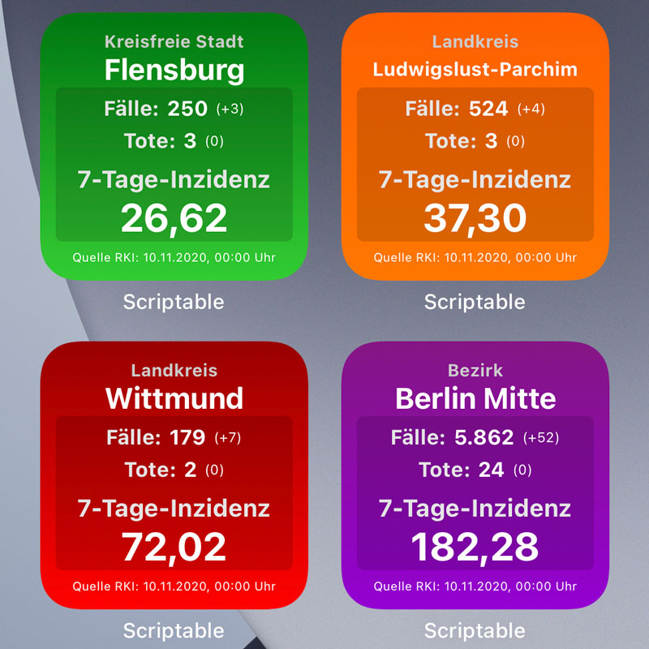
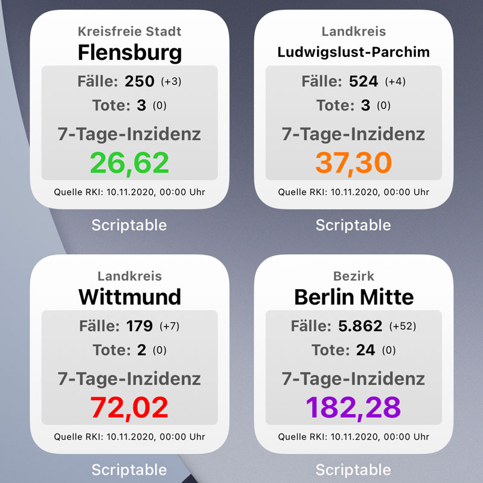
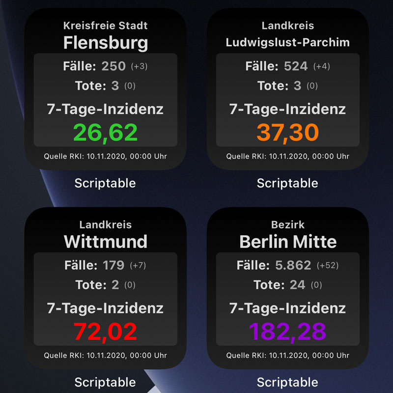

# Covid-19_Ampel, Ein Scriptable Widget
Ein Scriptable Widget zum Anzeigen der 7-Tage-Inzidenz und zusätzlichen Infos zu einen ausgwählten Region Deutschlands. 
Auswahl der Region über die Eingabe des entsprechenden Wertes im Parameter des Widgets. Wenn keine Eingabe erfolgt, wird alternativ die Region per GPS ermittelt.

 &nbsp; &nbsp; 

## Verwendung

* Download Scriptable App für iOS Geräte - https://scriptable.app
* Download/Import der Covid-19_Ampel.js Datei nach iCloud/Scriptable
* Auf dem Homescreen ein neues kleines Scriptable Widget erstellen
* Als Widget-Parameter kann die OBJECTID der Region verwendet
* Wird kein Widget-Parameter verwendet, wird die Region per GPS ermittelt

Die Region kann gemäß JSON-Eintrag -> RKI NPGEO Corona -> Corona Landkreise -> Key = OBJECTID als <strong>Parameter</strong> des Widget ausgewählt werden.
Hier findest du die Landkarte mit den Regionen: https://npgeo-corona-npgeo-de.hub.arcgis.com/datasets/917fc37a709542548cc3be077a786c17_0
Mit einem Klick in die Karte öffnet sich eine Tabelle mit den zugehörigen Infos. Die benötigte <strong>OBJECTID</strong> ist der erste Eintrag der Tabelle. 

Wird <strong>keine</strong> Region vorausgewählt, wird die Region per <strong>GPS</strong> ermittelt.
Für die Inzidenz für gesamt Deutschland kann <strong>de</strong> als Parameter verwendet.

Das Skript ist für kleine Widgets ausgelegt und wurde auf einem iPhone Xs und SE getestet.
Auf anderen Geräten kann es ggf. zu Abweichungen in der Darstellung kommen.

## Features

* Quelle der Daten: https://npgeo-corona-npgeo-de.hub.arcgis.com
* Zeigt die 7-Tage-Inzidenz und Anzahl der bisherigen Fälle und der Verstorbenen
* Die Werte in Klammern zeige die Differenz zum Vortag
* Wechselt gemäß der Geräteeinstellung automatisch in den Darkmode
* Warnstufen: <35 Grün, >35 Orange, >50 Rot, >100 Lila 
* Freie Wahl der Region durch Eingabe des Parameters im Widget
* Wird kein Widget-Parameter verwendet, wird die Region per GPS ermittelt
* Zum Anzeigen der Zahlen für Deutschland "de" als Widgetparameter eintragen
* Auswahl des Farbthemes über die Variable "WidgetTheme": "default" enspricht "Hell & Dunkel", "color" entspricht "Farbiger Hintergrund & Dunkel"

## Beispiele
Widgetstapel, helles Design | Region via GPS, dunkles Design 
 &nbsp;   
Widgets stapeln | Widgetparameter "de" 
  &nbsp; 

## Bekannte Probleme

* Darstellungsfehler bei anderen Geräten z. B. iPad

## Changelog
* v1.3 Möglichkeit der Auswahl eines "Themes", kleine Korrektur an der Titelzeile
* v1.2 Anzeige der Falldifferenz zum Vortag, Widgetfarben angepasst, Verwenden von "dynamic Color" für das Schalten vom Erscheinungsbild (light/dark) gemäß der iPhone Einstellung
* v1.1 GPS Funktionalität ergänzt
* v1.0 Release GitHub

## Hinweis zur Quelle und Lizenz
Die Daten sind die „Fallzahlen in Deutschland“ des Robert Koch-Institut (RKI) stehen unter der Open Data Datenlizenz Deutschland – Namensnennung – Version 2.0 zur Verfügung.
Robert Koch-Institut (RKI), dl-de/by-2-0, https://www.govdata.de/dl-de/by-2-0
https://www.rki.de/DE/Content/InfAZ/N/Neuartiges_Coronavirus/Fallzahlen.html

