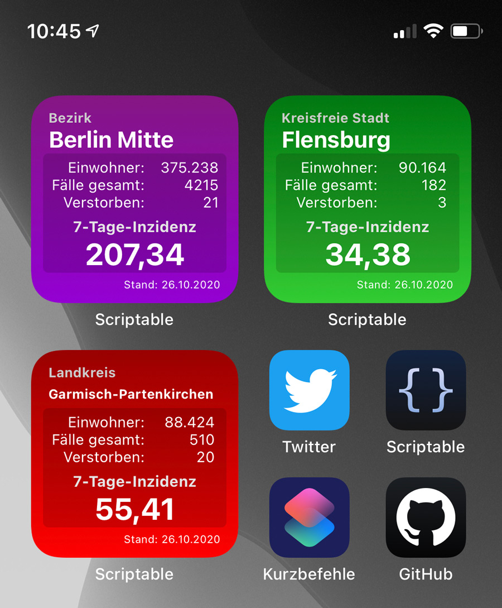
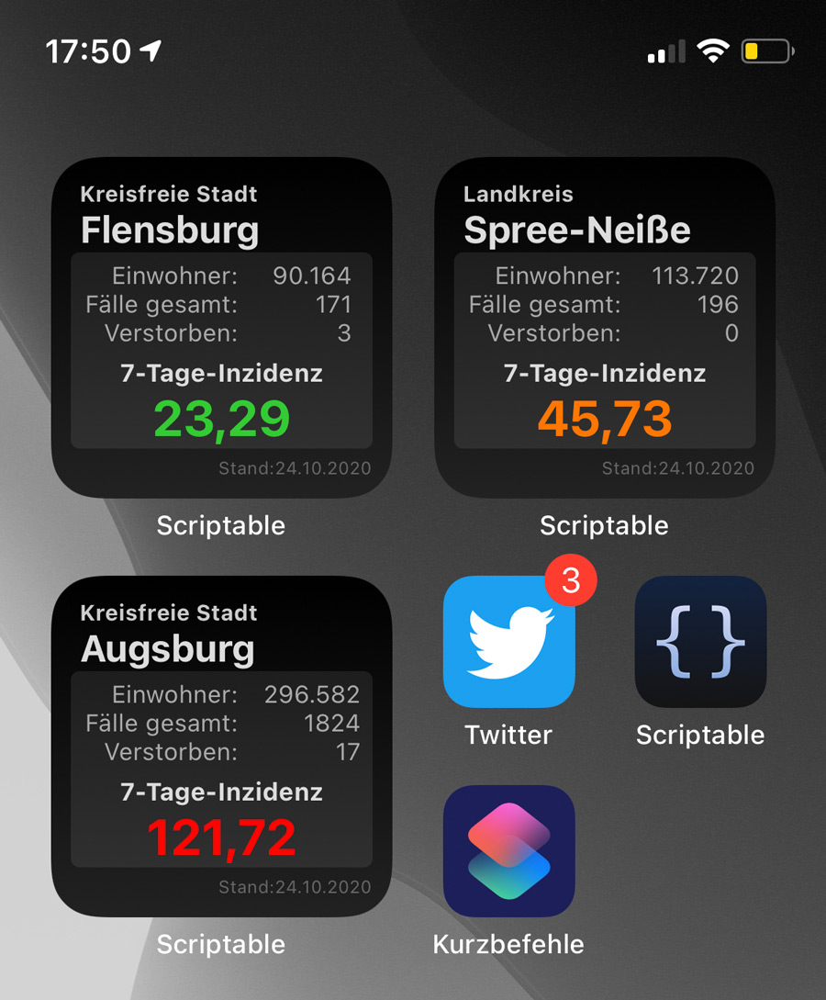
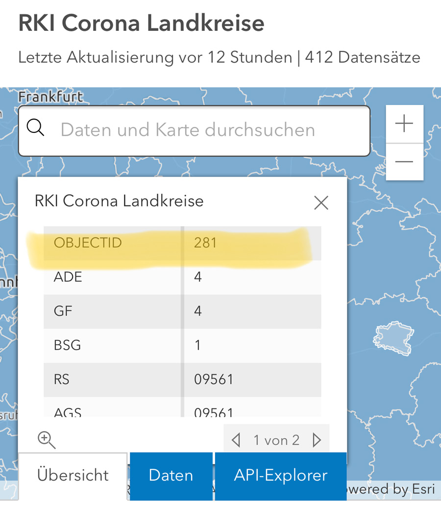

# Covid-19_Ampel, Ein Scriptable Widget
Ein Scriptable Widget zum Anzeigen der 7-Tage-Inzidenz und zusätzlichen Infos zu einen ausgwählten Region Deutschlands.

 &nbsp; 
 &nbsp; 

## Verwendung

* Download Scriptable App für iOS Geräte - https://scriptable.app
* Download/Import der Covid-19_Ampel.js Datei nach iCloud/Scriptable
* Auf dem Homescreen ein neues kleines Scriptable Widget erstellen
* Als Widget Parameter wird die OBJECTID der Region eingegeben

Die Region wird gemäß JSON-Eintrag -> RKI NPGEO Corona -> Corona Landkreise -> Key = OBJECTID als Parameter des Widget verwendet.
Hier findest du die Landkarte mit den Regionen: https://npgeo-corona-npgeo-de.hub.arcgis.com/datasets/917fc37a709542548cc3be077a786c17_0
Mit einem Klick in die Karte öffnet sich eine Tabelle mit den zugehörigen Infos. Die benötigte OBJECTID ist der erste Eintrag der Tabelle. 

Das Skript ist für kleine Widgets ausgelegt und wurde auf einem iPhone Xs getestet. Auf anderen Geräten kann es ggf. zu Abweichungen in der Darstellung kommen.

## Features

* Quelle der Daten: https://npgeo-corona-npgeo-de.hub.arcgis.com
* Zeigt neben der 7-Tage-Inzidenz auch Einwohnerzahl, Anzahl der bisherigen Fälle und der Verstorbenen
* Wechseln gemäß der Geräteeinstellung automatisch in den Darkmode
* Immer Darkmode verwenden: const allwaysDark = true 
* Ampel: <35 Grün, >35 Orange, >50 Rot, >100 Lila 

## Bekannte Probleme

* Beim Umschalten des Darkmode kann es zu Verzögerunen kommen.
* Darstellungsfehler bei anderen Geräten z. B. iPad

## Changelog

v1.0 Release GitHub

